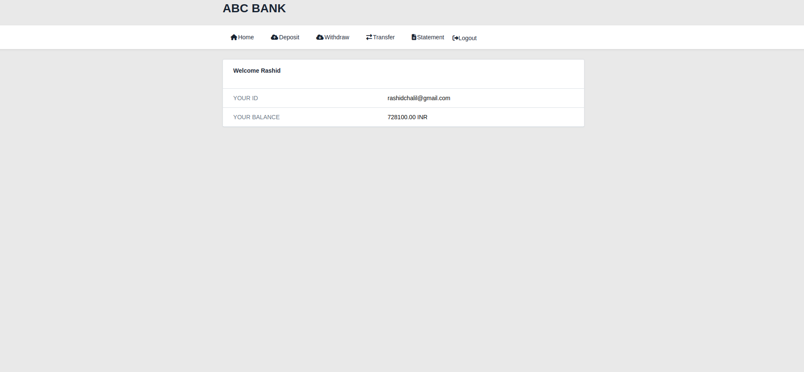
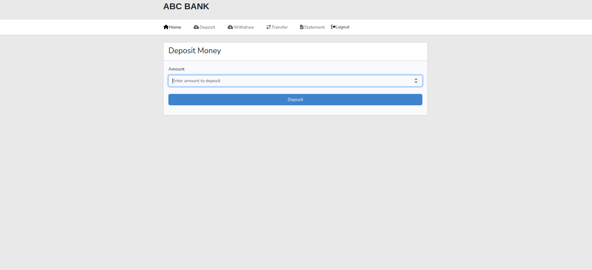
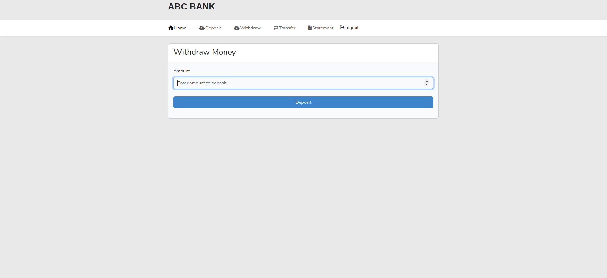
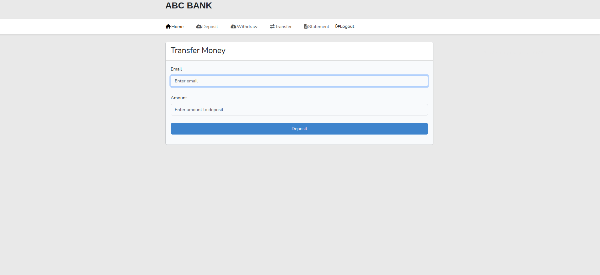
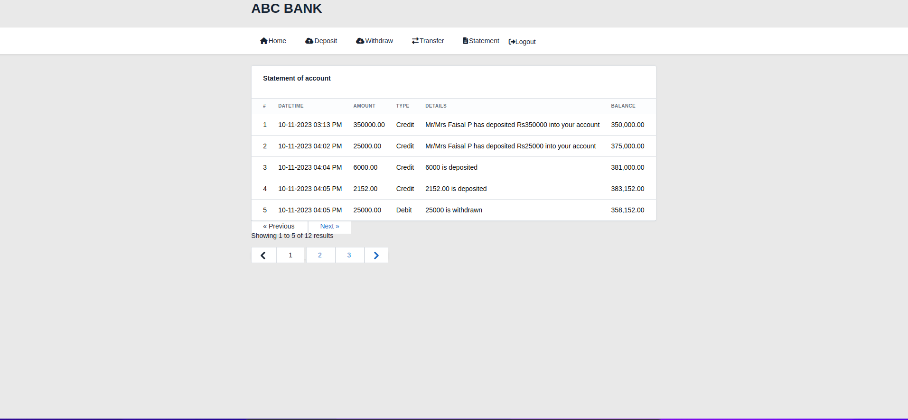

<a href="#">
    
</a>

## About The project
```
    The project creation involves the utilization of Laravel 10, Blade, Vite, and Bootstrap 6. 
    Laravel is a PHP framework known for its elegant syntax and powerful features, offering 
    efficient routing, database management, and authentication. Blade is the templating engine 
    used in Laravel, simplifying the creation of dynamic views. Vite is a fast development 
    server and build tool for modern web applications, providing a quick and seamless 
    development experience. Lastly, Bootstrap 6 is a popular front-end framework that offers 
    ready-to-use UI components for creating responsive and visually appealing web interfaces. 
    By combining these technologies, the project aims to create a robust and efficient 
    web application with a sleek user interface.
    
```

### Clone the code

### Create a Database named 'gsoft' and connect with your mysql credentials

```
DB_CONNECTION=mysql
DB_HOST=127.0.0.1
DB_PORT=3306
DB_DATABASE=gsoft
DB_USERNAME=example_username
DB_PASSWORD=example_password
```

## Install Packages and Libraries

```
composer install
npm install
npm run dev
```

## Migrate database
```
php artisan migrate 
```

## Local Deploying
```
php artisan serve
```

## Example Screenshots





